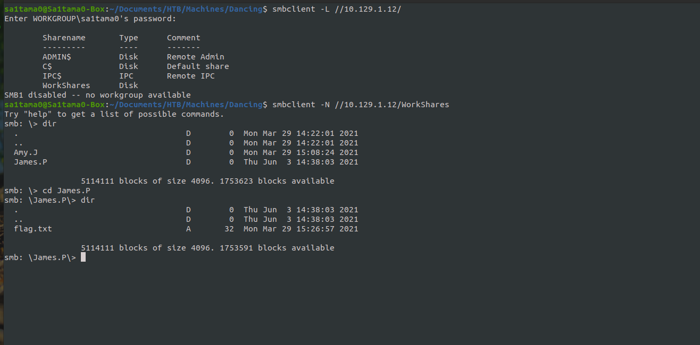

# Dancing


### Nmap

```bash
sa1tama0@Sa1tama0-Box:~/Documents/HTB/Machines/Dancing$ nmap -sC -sV 10.129.1.12 -oA nmap/initial
```
```
# Nmap 7.80 scan initiated Thu Jan 13 10:53:21 2022 as: nmap -sC -sV -oA nmap/initial 10.129.1.12
Nmap scan report for 10.129.1.12
Host is up (0.21s latency).
Not shown: 997 closed ports
PORT    STATE SERVICE       VERSION
135/tcp open  msrpc         Microsoft Windows RPC
139/tcp open  netbios-ssn   Microsoft Windows netbios-ssn
445/tcp open  microsoft-ds?
Service Info: OS: Windows; CPE: cpe:/o:microsoft:windows

Host script results:
|_clock-skew: 4h10m56s
| smb2-security-mode: 
|   2.02: 
|_    Message signing enabled but not required
| smb2-time: 
|   date: 2022-01-13T09:05:16
|_  start_date: N/A

Service detection performed. Please report any incorrect results at https://nmap.org/submit/ .
# Nmap done at Thu Jan 13 10:54:27 2022 -- 1 IP address (1 host up) scanned in 65.93 seconds
```
### smbclient
```bash
sa1tama0@Sa1tama0-Box:~/Documents/HTB/Machines/Dancing$ smbclient -L //10.129.1.12/
```
```bash
sa1tama0@Sa1tama0-Box:~/Documents/HTB/Machines/Dancing$ smbclient -N //10.129.1.12/WorkShare
```

