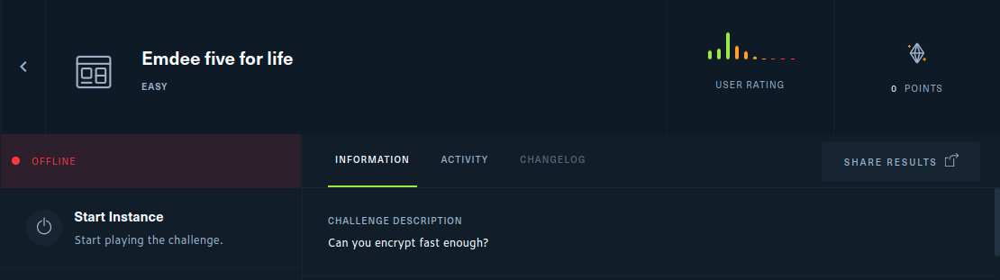
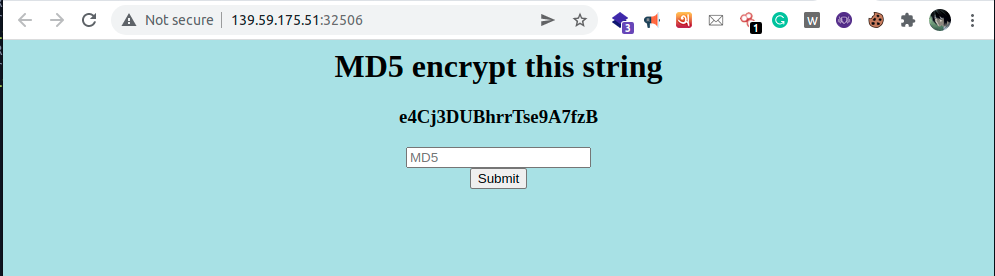
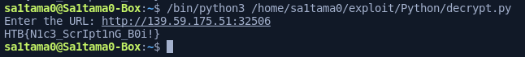

## [Emdee five for life](https://app.hackthebox.com/challenges/emdee-five-for-life)
##### CHALLENGE DESCRIPTION 
> Can you encrypt fast enough?


#### Let's have a look on the web page


### Solution
```python
import requests
from bs4 import BeautifulSoup
import hashlib

url = input("Enter the URL: ")

def flag():
    s = requests.session()
    r = s.get(url)
    r = BeautifulSoup(r.text, "lxml")
    r = r.find("h3").text
    r = hashlib.md5(r.encode())
    r = {"hash":f"{r.hexdigest()}"}
    r = s.post(url, data=r)
    r = BeautifulSoup(r.text,"lxml")
    r = r.find("p").text
    return r

while True:
    if "HTB" in flag():
        print(flag())
        break
```
```bash
python3 solution.py
```


```
HTB{N1c3_ScrIpt1nG_B0i!}
```
