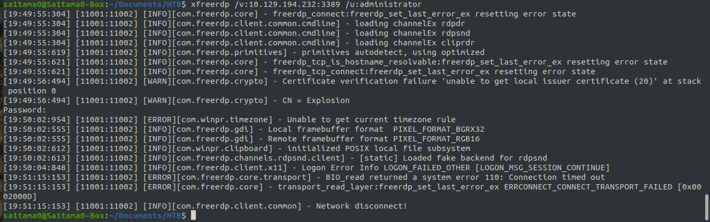

# Explosion


### Nmap

```bash
sa1tama0@Sa1tama0-Box:~/Documents/HTB/Machines/Explosion$ nmap -sC -sV 10.129.142.127 -oA nmap/initial
```
```
Starting Nmap 7.80 ( https://nmap.org ) at 2022-01-13 15:22 +06
Nmap scan report for 10.129.142.127
Host is up (0.21s latency).
Not shown: 996 closed ports
PORT     STATE SERVICE       VERSION
135/tcp  open  msrpc         Microsoft Windows RPC
139/tcp  open  netbios-ssn   Microsoft Windows netbios-ssn
445/tcp  open  microsoft-ds?
3389/tcp open  ms-wbt-server Microsoft Terminal Services
| rdp-ntlm-info: 
|   Target_Name: EXPLOSION
|   NetBIOS_Domain_Name: EXPLOSION
|   NetBIOS_Computer_Name: EXPLOSION
|   DNS_Domain_Name: Explosion
|   DNS_Computer_Name: Explosion
|   Product_Version: 10.0.17763
|_  System_Time: 2022-01-13T09:34:12+00:00
| ssl-cert: Subject: commonName=Explosion
| Not valid before: 2021-09-20T16:22:34
|_Not valid after:  2022-03-22T16:22:34
|_ssl-date: 2022-01-13T09:34:21+00:00; +10m57s from scanner time.
Service Info: OS: Windows; CPE: cpe:/o:microsoft:windows

Host script results:
|_clock-skew: mean: 10m56s, deviation: 0s, median: 10m55s
| smb2-security-mode: 
|   2.02: 
|_    Message signing enabled but not required
| smb2-time: 
|   date: 2022-01-13T09:34:16
|_  start_date: N/A

Service detection performed. Please report any incorrect results at https://nmap.org/submit/ .
Nmap done: 1 IP address (1 host up) scanned in 59.65 seconds
```

## Root
---
### xfreerdp

```bash
sa1tama0@Sa1tama0-Box:~/Documents/HTB/Machines/Explosion$ xfreerdp /v:10.129.194.232:3389 /u:administator
```


