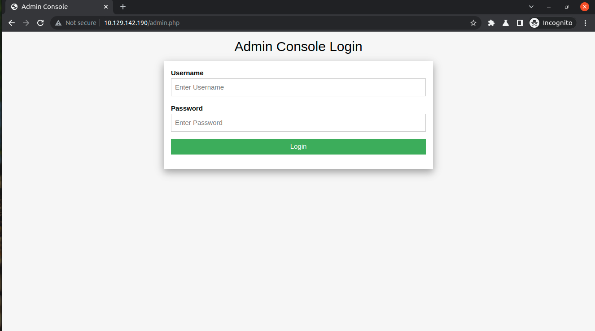

# Preognition


### Nmap

```bash
sa1tama0@Sa1tama0-Box:~/Documents/HTB/Preognition$ nmap -sC -sV 10.129.142.185 -oA nmap/initial
```
```
Starting Nmap 7.80 ( https://nmap.org ) at 2022-01-13 19:57 +06
Nmap scan report for 10.129.142.185
Host is up (0.22s latency).
Not shown: 999 closed ports
PORT   STATE SERVICE VERSION
80/tcp open  http    nginx 1.14.2
|_http-server-header: nginx/1.14.2
|_http-title: Welcome to nginx!

Service detection performed. Please report any incorrect results at https://nmap.org/submit/ .
Nmap done: 1 IP address (1 host up) scanned in 45.63 seconds

```

### Fuzzing with FFUF

```bash
sa1tama0@Sa1tama0-Box:~/Documents/HTB/Preognition$ ffuf -u http://10.129.142.185/FUZZ -e .php -w /opt/share/SecLists/Discovery/Web-Content/raft-small-words.txt 
```
```
        /'___\  /'___\           /'___\       
       /\ \__/ /\ \__/  __  __  /\ \__/       
       \ \ ,__\\ \ ,__\/\ \/\ \ \ \ ,__\      
        \ \ \_/ \ \ \_/\ \ \_\ \ \ \ \_/      
         \ \_\   \ \_\  \ \____/  \ \_\       
          \/_/    \/_/   \/___/    \/_/       

       v1.3.1-dev
________________________________________________

 :: Method           : GET
 :: URL              : http://10.129.142.185/FUZZ
 :: Wordlist         : FUZZ: /opt/share/SecLists/Discovery/Web-Content/raft-small-words.txt
 :: Extensions       : .php 
 :: Follow redirects : false
 :: Calibration      : false
 :: Timeout          : 10
 :: Threads          : 40
 :: Matcher          : Response status: 200,204,301,302,307,401,403,405
________________________________________________

admin.php               [Status: 200, Size: 999, Words: 132, Lines: 32]
```
### Web View



### Default Credentials

```
admin:admin
```

